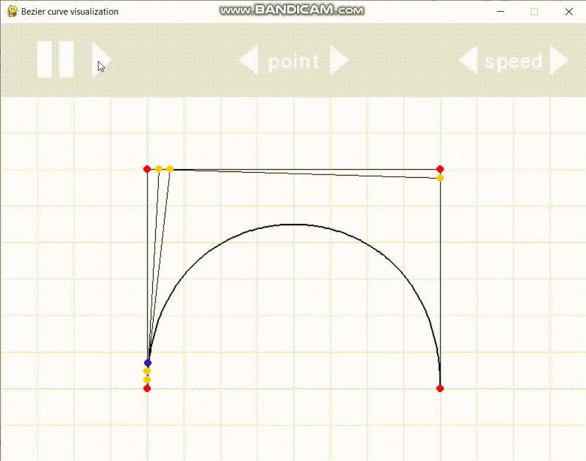

# bezier_curve_cg

The app visualizes the construction of Bezier curve by applying algorithm de Casteljau.

## Features
- variate the number of control points (from 2 to 6)
- change the position of control points (highlighted in red)
- adjust the playback speed
- stop/continue playback

## dependencies
- pygame

## Example

